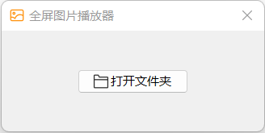

# Python PyQt6 全屏图片播放器项目

## 课程介绍

Qt 是非常强大的跨平台 GUI 框架，而 PyQt 是 Python 对 Qt 的封装。

本课程使用 Python PyQt6 带大家一步一步实现一个全屏图片播放器项目，课程内容有：

1. 项目演示；
2. 设计播放器主界面；
3. 实现选择文件夹；
4. 全屏自适应播放图片；
5. 实现暂停播放、暂停后继续播放；
6. 实现退出播放；
7. 程序发布。

## 项目截图

## 备注

课程代码等内容，在课程资料里面。

